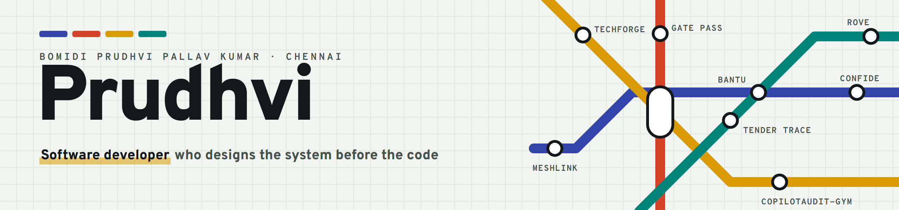

<picture>
  <source media="(prefers-color-scheme: dark)" srcset="banner-dark.png">
  
</picture>

I'm a third-year B.Tech student in AI & Data Science at JNN Institute of Engineering, Chennai. I write the design doc first, then build the whole thing: browser agents, offline mesh networks, serverless pipelines and the apps on top.

**Won the internal Smart India Hackathon 2026 round, 1st of 126 teams**, with Bantu: a browser agent that redacts your private data on the device before any LLM sees the page.

Everything I've built, with a diagram of how each one works: **[prudhvipallav.me](https://prudhvipallav.me)**

### Open to look at

- **[CopilotAudit-Gym](https://github.com/Prudhvipallav/Co-Pilot_Audit_Gym)**: an RL environment for reviewing AI products before launch. I trained Qwen2.5-0.5B on it with GRPO. [Live on Hugging Face](https://huggingface.co/spaces/Prudhvi06/Co-Pilot_Audit_Gym)
- **[StudentTrack Pro](https://github.com/Prudhvipallav/Study-tracker)**: the study planner I built for myself, offline on Windows and Android. [Download it](https://github.com/Prudhvipallav/Study-tracker/releases)
- **[Tender Trace](https://github.com/dhruva8405/Tender-Trace)**: graph checks for shell-company patterns in government contracts, on AWS. Built at AI ASCEND 2026.
- **[Gnana](https://github.com/prudhvipallavkumarbomidi/gnana)**: a VS Code extension that lets several developers or AI agents work as one team, over encrypted P2P.

### Kept private

Most of what I build lives in private repos: Bantu, MeshLink, Confide, the gate-pass system for my college, ROVE and more. I'm happy to walk through any of them on a call.

### What I work with

Python, TypeScript, Kotlin · FastAPI, Node.js, Django · Postgres and Supabase · React, React Native, Jetpack Compose · AWS (Lambda, SQS, Bedrock) · PyTorch, TRL

**Reach me:** [prudhvipallavkumarbomidi@gmail.com](mailto:prudhvipallavkumarbomidi@gmail.com) · [prudhvipallav.me](https://prudhvipallav.me)
